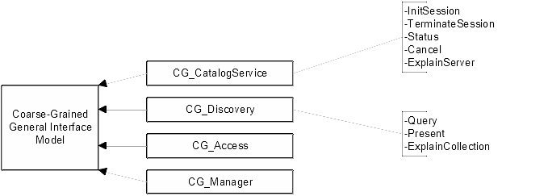

[[background]]
== Background

=== Catalog Services Implementation Specification

According to the OpenGIS Catalog Services Implementation Specification, OGC Catalog servers have three kinds of services:

* *Discovery Service;*
* *Access Service;*
* *Management Service.*

Discovery Services are those services which allow a client to locate metadata that describe data. Access Services provide the client with methods to request services on the data. Access Services have been divided into two types: Direct Access and Brokered Access. Management Services define methods for a client to change the metadata held by a catalog.

The Discovery Service has to be provided by all Application Servers claiming compliance with the OGC Catalog Interface. The Access and Management Services are optional for an OGC compliant catalog.

The Catalog Services General Model provides the standards of compliance for specific implementation communities, in a profile-based way. There are different profiles for each Distributed Computing Platform, like CORBA, OLEDB and WWW. The test program is specific for CORBA in combination with a coarse-grained interface. This means that the client and server have very little knowledge of each other. Therefore, the interface in this environment must be flexible, well-defined and simple.

As specified in the Coarse-Grained General Interface Model there are four major interfaces, CG_CatalogService, CG_Discovery, CG_Access and CG_Manager. These interfaces allow the discovery, access and management of geospatial data and services. The above-mentioned model has been based on the concept of interface operations passing Request-Response Message Pairs between a client and a server. Stated another way, the Coarse-Grained architecture uses a messaging-based structure to describe the access and invocation of Catalog services.

The Catalog Certification Program is centered on the CG_Discovery interface, it will test all the functionality supported by the discovery service as well as all the functionality of the CG_CatalogService interface. The Catalog Certification Program focuses on these two interfaces because as said before the Access and Management Service are optional.

=== CG_CatalogService Interface

Server level interfaces provide access to the services that support the establishment and management of a user session through operations. The operations included in this interface that have to be supported by all servers are listed in <<fig1>>. The _InitSession_ operation generates a unique identifier used to track the context of a session. To terminate a session, the _TerminateSession_ operation can be used. The _Status_ operation checks the status of a currently pending request. To terminate a request, the _Cancel_ operation should be used. The _ExplainServer_ operation lists all conventions and services available during the current session.

In the current version of the Catalog Certification Program only synchronous requests are considered. This rules out the possibility to test for the CancelRequest and Status operation.

=== CG_Discovery Interface

The CG_Discovery Interface provides users with a way to discover what data, services and other resources are available to them. This interface does not provide access to the resources themselves. The operations provided by this interface can be deducted from <<fig1>>. The _Query_ operation searches for data on or services from a given catalog server and may return records from the result set. The _Present_ operation retrieves records from a result set created by issuing a query. To get an explanation of the data model of the catalog the _ExplainCollection_ operation can be used.

[[fig1]]
.The Coarse-Grained (CG) General Interface Model.
 

