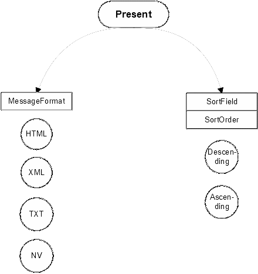

== Description of the test procedures

=== Introduction

This section details the tests that have to be executed to test all the operations mentioned in <<background>>. In order to test the operations, a default query is sent to the catalog server being tested. The database is a known XML (eXtendable Markup Language) file. The retrieved results will be compared with the expected results. A series of queries, applying multiple aspects of the Query Language, will be tested.

To test for a distributed search, two servers are used using both the sample XML file.

An example of the database with metadata is given in appendix A. If a server is not capable of using a database in XML format, the XML file should be ported to a supported format.

=== Operations of the CG_CatalogService interface

==== Testing the InitSession operation

In order to test whether or not the InitSession operation is supported by the server, the Catalog Certification Program follows the following steps:

[class=steps]
. It tries to read the default IOR (Interoperable Object Reference) file, which contains the address of the catalog server;
. It initializes the ORB (Object Request Broker);
. It creates a reference to the catalog server;
. If step 3 has been successful, it creates an InitSession request and invokes this method on the server;
. It retrieves the identifier, which will be used in the current session.

If any of these steps fail, the InitSession operation is not supported by the server being tested.

==== Testing the TerminateSession operation

The Catalog Certification Program tests whether or not the identifier of the session and the reference to the catalog server exist. If these two constraints are met, the TerminateSession method is invoked and a TerminateSession response is sent by the server.

If the status of the TerminateSession response is successful and no exception has been raised, the TerminateSession operation is considered supported. In order to be compliant with the specification, the server should send a successful status when the session has been terminated in a correct way.

==== Testing the ExplainServer operation

For invoking this method on the catalog server, the _capabilities_ field in the request is filled with all the ctAllSupportedRequest. After invoking this method, the server returns a response, which should contain a list of all the capabilities supported by the server. There is no _status_ in the ExplainServer response. The Catalog Certification Program works as follows: if the catalog server sends an empty list or if an exception is raised during the process of testing, the ExplainServer operation will be considered not supported. For a full compliance the server should return a list of all capabilities that are supported, the correct capabilities are specified in the OpenGIS Catalog Services Implementation Specification as CG_CapabilityType. At least the OGC_Common QueryLanguage should be supported, the contents of the other capability types can not be tested.

=== Operations of the CG_Discovery interface

[[query]]
==== Query

A query is built by combining a set of parameters in a request. For some parameters there is no viable way to test if their different values are working or they are part of an asynchronous operation. To overcome this problem, their value is fixed in the request (iteratorsize=100, cursor=0, asynchronous=false, maxlevel=2, presentation=full, entrytype=collection).

There is a general approach for testing the operations, although some of them differ slightly from this general approach. The general approach can be described as:

* if a general exception occurs during the _query_ call, the capability which is being tested at that moment will be considered _not tested_;
* if a successful status of the response has been retrieved, the capability will be considered _supported_;
* if an unsuccessful status has been retrieved, it depends on the capability if it is considered not supported or not tested.

If, during the initial invocation of the query operation, a general exception is raised or an invalid status is returned, the query operation will be considered as not supported. This test checks the results retrieved in NV format (name-value pairs). If the NV format is not supported by the server, the query method will only be considered supported if no exception has been raised during a call with another format and if the retrieved status is successful. The parameters tested and their possible values are shown in <<fig2>>:

[[fig2]]
.Outline of the parameters (boxes) involved in the Query operation and their possible values (circles).

===== CollectionName

The CollectionName parameter can have two possible values:

* CollectionID: this parameter value combination is considered successful if, after invoking the query method, the status returned is success and there are no problems with reading the string that this field contains;
* CollectionName: the same procedure is followed as with CollectionID.

When the query method is invoked there are several parameters in the request and there is no way to know which parameter is failing if an unsuccessful status is retrieved. If a general exception occurs during the remote call this capability will not be tested, as we do not know for sure which parameter is causing the exception.

===== QueryLanguage

While testing this parameter, the ReturnFormat is set to NV, the QueryScope is local and the ResultType equals results. This means this part of the test depends strongly on the success of the NV format. For the QueryLanguage parameter two values are valid:

* OGC_Common: if an exception is returned, this capability will be considered as not tested. If the response status is unsuccessful, the capability is considered not supported. If none of the above failures occurs, and if the retrieved number of hits is correct, the capability will be considered supported;
* Z3950_TypeOne: the same procedure applies to this language as to the OGC_Common language.

[[messageformat]]
===== MessageFormat

In order to test the different values of this parameter, the QueryScope is set to local, the ResultType is results and the QueryLanguage OGC_Common. The series of queries is invoked in combination with the following values of MessageFormat:

* XML: if an exception is raised during invocation of the query method or if the status is unsuccessful, this capability (MessageFormat=XML) will not be tested. Otherwise, the program will test if the return format is the correct one. First of all the program will compare if the _returnFormat_ field in the request matches the _retrieveData.encoding_ field in the response. After this, the retrieved string will be read and searched for "<?xml". If both conditions are met, the capability will be considered supported;
* HTML: the same applies to this format, only in this case the string is searched for "<html>" and "</html>";
* TXT: the same applies here, but in this case, the string cannot be searched for a specific substring, so it can only be tried to read the string;
* NV: the same applies, it will be tried to read the retrieved NV values, if the number of NV pairs matches the correct number of hits, this capability is considered supported.

===== Number of hits retrieved

To test this parameter, the QueryScope is local, the ResultType equals results, the MessageFormat is NV and the QueryLanguage is set to OGC_Common. If the NV format is not supported by the server, it's not possible to test if the field containing the number of hits in the response is working. The only thing that is tested for is whether or not this field contains the number of hits found in the search which should equal the number of NV pairs (it doesn't have to be the correct number of hits which is to be expected, but it can be). If an exception occurs or if the status is unsuccessful, this capability will not be tested.

[[sortorder]]
===== SortOrder

Again, the QueryScope is set to local, the ResultType is results, the MessageFormat equals NV and the language is OGC_Common. The SortOrder has two possible values: ascending or descending. The sort order should always be used in conjunction with a SortField, like in the following example:

[source=ruby]
----
sortField[0] = OGC_CatalogService.CG_SortField ("title", OGC_CatalogService.CG_SortOrder.ascending)
----

In this example the Catalog Certification program will test whether or not the results are ordered by title in an ascending way. The possibility of testing this capability depends on the support of the NV format. If an exception occurs, this capability will not be tested. If the status is successful and the NV format is supported, the sorting order will be checked using an array.

===== ResultType

There is no easy way to test this parameter, it is difficult to know if a query call is failing due to the query method itself or due to another capability. There are four different values possible for the parameter ResultType, they are:

* Results: if an exception is raised or a status is unsuccessful, the results capability will be considered not supported. In order to be considered supported, the test should work for one or more of the formats. When the Catalog Certification Program invokes the query method for testing the NV format, it will test the results too. If a general exception occurs, the status obtained will be the status obtained with another format. If the status is unsuccessful or if the retrieved number of hits doesn't match the correct number of hits, this capability will be considered unsupported;
* Validate: if an exception is raised or if an unsuccessful status is retrieved, this capability will be considered not supported. Otherwise, the program will test if the _retrieveData_ field in the response is empty (this should be the case because only a validation should be performed). Testing if the field is empty is done using the txt format and looking for an empty string "";
* Hits: testing this capability is almost equivalent to the Validate test. In addition, the number of hits is checked;
* ResultSetID: this capability is tested equivalent to the Validate test with one addition: the program also checks whether or not the collectionID field is filled.

===== QueryScope

The MessageFormat is fixed as NV, the ResultType as results. The two options for QueryScope are:

* Local: if an exception occurs during the invocation of the query method, this capability will not be tested. If the status is successful and the correct number of hits is retrieved, this capability will be considered as supported;
* Distributed: because of the use of 2 servers during the test of the distributed query, the correct number of hits should be 2 times the correct number of hits using a local scope. 

===== GeographicBoundingBox

The QueryScope is local, the MessageFormat equals NV and the ResultType results. The queryExpression used is given by:

[source,ruby]
----
queryExpression=OGC_CatalogService.CG_QueryExpression("intersects(GeographicBoundingBox,envelope(40.71,-24.17,71.26,27.63))","", OGC_CatalogService.CG_QueryLanguage.OGC_Common)
----

The correct number of hits for this query, with respect to the standard metadata datbase, is 2. If an exception occurs, this capability will be considered not tested. If the status of the response is invalid or if the returned number of NV pairs doesn't match the expected number of hits, this capability is considered not supported.

===== Invalid query request

This capability will show if the server is able to detect an invalid query and act in the right way. The MessageFormat is again of the NV type. The query which is invoked is: "abstract lkdd 'river%'". The server has to return an exception or an invalid status in order to consider this capability as supported.

==== Present

In order to test for this operation of the CG_Discovery interface, some parameters have to be fixed in the request, these are: Iteratorsize(100), Cursor(0), Presentation(full) and ResultSetID(ResultSetID sent by the query). Other parameters and their possible values are shown in <<fig3>>.

The general approach which applies to the testing of the capabilities of present is equal to the general approach of the query method (see <<query>>). First of all the Catalog Certification Program will set the _Present_ capability to not supported but in case one of the calls was successful the capability will be considered supported. If a successful status is retrieved, the last check will be using the NV format, i.e., the program will check if the functionality of this method is working testing the results retrieved with NV format. If the NV format is working the present capability will be shown as supported if the number of hits retrieved is the number of hits expected by the test.

[[fig3]]
.Parameters (in boxes) and their possible values (in circles) of the present operation of the CG_Discovery interface.

===== MessageFormat

The possible values for this parameter are equivalent to those of the query method:

* XML: the same applies here as for the MessageFormat of the query method (<<messageformat>>);
* HTML: idem;
* TXT: idem;
* NV: idem.

===== Number of hits retrieved

The field containing the number of hits has to have a value equivalent to the number of NV pairs. After invocation of the present method, no exception should be raised and a successful status should be returned. In this case, this capability will be considered supported.

===== SortOrder

There are two options for this parameter: ascending and descending. If the NV format in present is working, this parameter can be tested. The same applies here as to SortOrder of the query method (<<sortorder>>).

[[fig4]]
.The parameters (in boxes) and their possible values (in circles) of the ExplainCollection method.

==== ExplainCollection

The ExplainCollection is the last operation of the CG_Discovery interface to be detailed. In order to test this operation, the following parameters are fixed:

* collectionID.collectionID("")

* AttributeCategory = OGC_CatalogService.CG_AttributeCategory.both

There is no viable way to test all the parameters of this method. Both the CG_ExplainCollectionRequest and the CG_ExplainCollectionResponse contain parameters which cannot be tested. The parameters that are tested are shown in <<fig4>>. If a general exception is raised during the remote call the different parameters will be considered not tested. The overall ExplainCollection capability will first be set to not supported, if one of the submethods is supported, the overall capability is also set to supported. Because of the combination of parameters it's difficult to render a probable cause of a failure.

===== CollectionName

As with the query method, the CollectionName can have a value of:

* CollectionID: if it's possible to read the string that this field contains and if the status is successful, this capability will be considered supported;
* CollectionName: the same applies here as to CollectionID.

===== Format

As with Query and Present, the format can be one of the following options:

* XML: in this case there is no _retrievedData_ field in the response sent by the server, so the only way to test for this capability is to check whether or not the status is successful;
* HTML: the same applies here as to XML;
* TXT: idem;
* NV: idem.

===== Parameters not tested

The attributeCategory could be tested in the same way the format is, i.e., testing if the status is successful but there is no way to know if the _queriable_ or _presentable_ attributes are working in a correct way. The dataModel attribute is not tested for because it's impossible to test the information each database contains.
