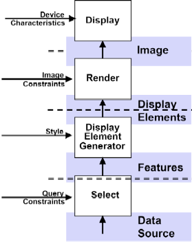
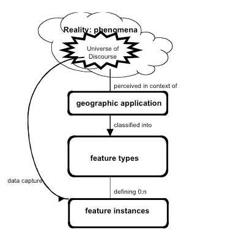
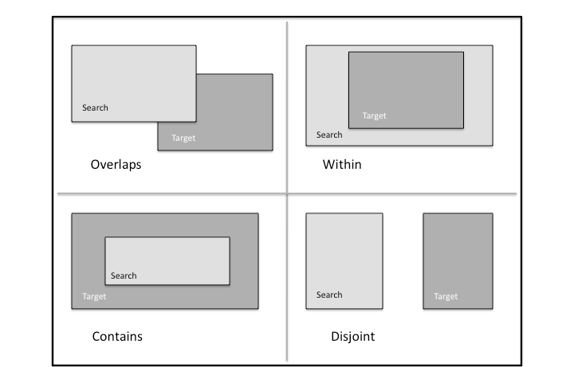

== Geospatial Information

=== Geospatial Information Is Fundamental or “Everything is somewhere”

Geospatial information is a ubiquitous element of almost all data. Whether represented as a map or an image, encoded as an address, zip code, or phone number, described in a text passage as a landmark or event, or any of the many other ways of representing Earth features and their properties; geography is pervasive.

Geospatial *location* and *time* are integral to all aspects of the work in the OGC and OGC standards. Geography is a foundational property for modeling the world in a coherent, intuitive way. Location and time can be exploited as a unifying theme to better understand the context of most real and abstract phenomena.

=== Information Specifications

The OGC Standards Development Process creates Abstract and Implementation specifications. The purpose of the Abstract Specification is to create and document a conceptual model to support the creation of Implementation Specifications. Implementation Specifications are unambiguous technology platform specifications for implementation of industry-standard, software application programming interfaces. Geospatial domain semantics defined in the Abstract Specifications are to be consistent across multiple technology platforms as defined in Implementation Specifications.

The Information Viewpoint section of the ORM describes both Abstract and Implementation specifications for geospatial information. For example, the key concepts used by Geography Markup Language (GML) to model the world are drawn from the OpenGIS Abstract Specification and the ISO 19100 series of International Standards.

OGC Information Specifications are used in conjunction with other information technology standards. The OGC Abstract Specifications are used to bring geospatial semantics to more general IT specifications, for example using the OGC Coverage specification with grid encoding formats. Elements of the OGC GML Implementation Specification are embedded in other specifications.

[[spatial_referencing]]
=== Spatial Referencing

Location is contextually simple and intuitive to most people. For example, people can relate to where they are on a map, follow directions to a place, readily grasping the spatial context of their local environment, and so forth. For computers to exchange geospatial data, clear definition of the location and the spatial referencing system is required.

Locations can be described by using different types of spatial referencing systems:

[class=steps]
. Civic locations using geographic terms or identifiers;

. Coordinates as numeric values in a coordinate reference system.

. Linear referencing for linearly located events and linear segments.

Civic locations may be unique identifiers or place names. Spatial referencing with identifiers occurs when the *identifier* uniquely indicates a location, such as a postal code. Place names may be ambiguous, such as “Springfield”, requiring additional information so that this place name can be resolved into a specific location identified by coordinates. Gazetteers and geocoding are geospatial operations or processes used to convert a place name into a geographic coordinate. The OGC http://portal.opengeospatial.org/files/?artifact_id=15529[Gazetteer Service] Best Practice utilizes a gazetteer data model defined in http://www.iso.org/iso/iso_catalogue/catalogue_tc/catalogue_detail.htm?csnumber=26017[ISO 19112]: “Spatial referencing by geographic identifiers.” Turn to <<ogc_web_services>> for more about the OGC Gazetteer Service.

*Coordinates* are a sequence of N numbers designating the position of a point in N-dimensional space. Coordinates are always expressed using some coordinate reference system (CRS). A *coordinate reference system* is a coordinate system that has a reference to the Earth. CRSs are defined in the OGC Abstract Specification: Topic 2 - http://portal.opengeospatial.org/files/?artifact_id=6716[Spatial Referencing by Coordinates], also published as ISO 19111. This document also describes coordinate transformations and coordinate conversions between two different coordinate reference systems. With such information, geographic data referred to different coordinate reference systems can be merged together for integrated manipulation. A *map projection* is a coordinate conversion from a geodetic coordinate system to a planar surface, converting geodetic latitude and longitude to plane (map) coordinates. The result is a two-dimensional coordinate system called a projected coordinate reference system.

OGC has defined several methods for encoding Coordinate Reference Systems:

* The OpenGIS® Implementation Specification for Geographic Information - http://www.opengeospatial.org/standards/sfa[Simple feature access - Part 1: Common architecture], also published as ISO 19125-1, defines “Well-known Text Representation of Spatial Reference Systems.” The specification provides a non-exhaustive list of Geodetic Codes and Parameters for defining the objects in the Well-Known Text Representation.

* The OGC Best Practices Paper for http://portal.opengeospatial.org/files/?artifact_id=24045[Definition identifier URNs in OGC namespace] specifies Universal Resource Names (URNs) in the OGC URN namespace to be used for identifying definitions, including definitions of Coordinate Reference Systems (CRSs) and related objects, as specified in OGC Abstract Specification Topic 2: Spatial referencing by coordinates. This document specifies the formats used by these URNs, including formats that can reference definitions recorded in the EPSG database and by other authorities.

There are a variety of practices, specifications, and standards for how spatial geometry coordinates (axes) are ordered. Geodesy, computational geometry, graphics processing, and computer-aided design – all have different rules for specifying or encoding axis order. The OGC developed an http://www.ogcnetwork.net/node/491[Axis Order Policy and Recommendations] summarized as “in all cases, honesty is the key”. In other words, any documentation, encoding, payload, or service interface must state how the coordinate axis order is actually encoded in the coordinate strings.

The http://www.opengeospatial.org/standards/as[OGC Abstract Specification: Topic - Linear Referencing System] (to be published) defines a conceptual schema for locations relative to a one-dimensional object as measurement along (and optionally offset from) that object. It defines a description of the data and operations needed to use and support linear referencing.

[[maps_kml_pdfs]]
=== Maps, KML, and PDFs

A *map* is a visualization of geographic information. <<fig1>> shows how maps differ from other types of geospatial information. A map may be a digital image file suitable for display on a computer screen; a map is not the data itself. Examples of map encodings include jpg, gif and other file types.

The http://www.opengeospatial.org/standards/kml[OGC KML Standard] is an XML grammar to encode and transport representations of geographic data for display in an earth browser, such as a 3D virtual globe, 2D web browser application, or 2D mobile application. Put simply: KML encodes what to show in an earth browser, and how to show it. Geographic visualization includes not only the presentation of graphical data on the globe, but also the control of the user's navigation in the sense of where to go and where to look. The OGC http://portal.opengeospatial.org/files/?artifact_id=30203[KML Standard Development Best Practice] provides guidelines for developing the OGC KML standard.

The http://portal.opengeospatial.org/files/?artifact_id=40537[OGC PDF Georegistration Encoding Best Practice] describes an extension to the Adobe® Portable Document Format (PDF) for creating PDF objects that identify a region of the PDF page as a map and describe the map’s coordinate systems. The intent of this specification is to codify xisting practice. The intent is not to make this specification an OGC standard. An OGC Best Practice should not be referred to as a standard.

[[fig1]]
.Maps, Display, Features and Data (Source: WMS 1.0, OGC document 00-028)

=== Geographic Features

A *feature* is an abstraction of a real world phenomenon. A *geographic feature* is a feature associated with a location relative to the Earth. A digital representation of the real world can be thought of as a set of features.

The OGC approach to feature modeling follows the principles specified in http://www.iso.org/iso/iso_catalogue/catalogue_tc/catalogue_detail.htm?csnumber=39891[ISO 19109:2005], “Geographic information - Rules for application schema.” As shown in <<fig2>>, *Conceptual schemas* define abstract feature types and provide the process for domain experts to develop *application schemas* that are used to encode content describing feature instances. The developer of an application schema may use feature definitions from feature catalogues that already exist. The process for defining an application schema is described in <<gml_application_schemas>>.

[[fig2]]
.Modeling Geographic Information (Source: ISO 19109:2005)

Any feature may have a number of *properties*. These properties may be operations, attributes or associations. Any feature may also have a number of *attributes*: Spatial, Temporal, Quality, Location, Metadata, Thematic. A feature collection is a feature that represents a collection of features that have common metadata and formal relationships. Collections possess all the characteristics of a feature.

Geographic phenomena fall into two broad categories, discrete and continuous. Discrete phenomena are recognizable objects that have relatively well-defined boundaries or spatial extent. Examples include buildings, streams, and measurement stations. Continuous phenomena vary over space and have no specific extent. Examples include temperature, soil composition, and elevation. A value or description of a continuous phenomenon is only meaningful at a particular position in space (and possibly time). Temperature, for example, takes on specific values only at defined locations, whether measured or interpolated from other locations. These concepts are not mutually exclusive. In fact, many components of the landscape may be viewed alternatively as discrete or continuous. Historically, geographic information has been treated in terms of two fundamental types called *vector* data and *raster* data.

“Vector data” typically deals with discrete phenomena, each of which is conceived of as a feature. “Raster data,” on the other hand, deals with real world phenomena that vary continuously over space. Raster is included in the OGC the *“coverage”* concept. A *coverage* defines a data model that associates spatio-temporal positions to data values. The data attributes of a coverage vary across its spatio-temporal extent.

=== Geometry and Topology

Geometry provides the means for quantitative description of the spatial characteristics of features, including dimension, position, size, shape, and orientation. Topology is useful for characterizing relationships between geometric objects without concern for the size or exact shape of the objects.

The conceptual model for geometry and topology is contained in OGC Abstract Specification Topic 1 - Feature Geometry, also published as http://www.iso.org/iso/iso_catalogue/catalogue_tc/catalogue_detail.htm?csnumber=26012[ISO 19107:2003] Geographic information -- Spatial schema. OGC has implemented the conceptual model of ISO 19107 in the http://www.opengeospatial.org/standards/gml[OGC Geography Markup Language] as described in <<geography_markup_language>>.

A *geometric object* is a combination of a coordinate geometry and a coordinate reference system. In general a geometric object is a set of geometric points, represented by *direct positions*. A direct position holds the coordinates for a position within some coordinate reference system. Typical geometric objects are points, lines, and polygons.

Geometric calculations such as containment (point-in-polygon), adjacency, boundary, and network tracking can be computationally intensive. A productive use of topology is to accelerate computational geometry. Another purpose is, within the geographic information domain, to relate feature instances independently of their geometry.

Spatial query operators are a mechanism for characterizing topological relations between different features. The operators are meant mainly for query evaluation and are defined in such a manner as to allow a variety of implementations to be assured of equivalent results against datasets with equivalent information content. The Simple Features Access and the OGC Filter Encoding Implementation standards provide typical names for spatial query operators (See <<fig3>>). OGC Abstract Specification Topic 1 – Geometry provides a more exhaustive standardization of spatial operators.

[[fig3]]
.Spatial query operator examples

[[geography_markup_language]]
=== Geography Markup Language

==== The GML Standard

The http://www.opengeospatial.org/standards/gml[OpenGIS® Geography Markup Language (GML) Encoding Implementation Standard] is an http://en.wikipedia.org/wiki/XML[XML] grammar to express geographical features. GML serves as a modeling language for geographic systems as well as an open interchange format for geographic transactions on the Internet. The GML information model is based on the ISO 19100 series of International Standards and the OGC Abstract Specification. In addition, GML provides XML encodings for additional concepts not yet modeled in the ISO 19100 series of International Standards or the OpenGIS Abstract Specification, for example, dynamic features, simple observations or value objects.

GML defines the XML Schema syntax, mechanisms and conventions that:

* Provide an open, vendor-neutral framework for description of geospatial application schemas for the transport and storage of geographic information in XML;

* Allow profiles that support proper subsets of GML framework descriptive capabilities;

* Support the description of geospatial application schemas for specialized domains and information communities;

* Enable the creation and maintenance of linked geographic application schemas and datasets;

* Support the storage and transport of geospatial application schemas and datasets;

* Increase the ability of organizations to share geographic application schemas and the information they describe.

Implementers may decide to store geographic application schemas and information in GML, or they may decide to convert from some other storage format on demand and use GML only for schema and data transport.

The requirements of an application schema determine the XML Schema components from the GML schema to be included in a GML profile. GML defines a variety of conformance classes that apply depending upon the content of a specific profile. Examples of GML Conformance Classes for GML Profiles are shown in <<table2>>. See the GML standard for the full list.

[[table2]]
.Examples of Conformance Classes for GML Profiles
|===
| Geometric primitives: 0, 1, 2 or 3 dimensions | Coordinate reference systems
| Topologic complexes: 0, 1, 2 or 3 dimensions | Coordinate operations
| Temporal geometry — 0 or 1 dimensions | Temporal reference systems
| Temporal topology | Dictionaries
| Dynamic features | Units dictionaries
| Observations | Abstract coverage
| Discrete point coverage | Discrete curve coverage
| Discrete surface coverage | Discrete solid coverage
| Grid coverage | Continuous coverage

|===

==== Profiles of GML

To promote broad use of GML, the OGC has defined several http://www.opengeospatial.org/standards/gml[profiles of GML]. In the OGC, a GML profile is a restricted subset of the full GML standard.

[%unnumbered]
|===
h| GML Profile h| Document Type
| GML Simple Features profile | Standard
| GML Common CRSs profile | Standard
| GML CRS support profile | Standard
| GML Grid CRSs profile | Standard
| GML Simple dictionary profile | Standard

|===

[[gml_application_schemas]]
==== GML Application Schemas

Designers of GML application schemas may extend or restrict the types defined in the GML schema to define appropriate types for an application domain. GML application schemas use applicable GML schema components, either directly or by specialization, and are valid in accordance with the rules for XML Schema. The OGC membership has approved a number of GML Application Schema as Standards and Best Practices:

[%unnumbered]
|===
h| GML Application Schema h| Document Type
| CityGML | Standard
| GML Application Schema - Coverages (1.0) | Standard
| Moving Object Snapshot (adoption pending) | Standard
| GML Application schema for Earth Observation products | Standard
| GML PIDF-LO Geometry Shape Application Schema for use in the IETF | Best Practice
| GML Encoding of Discrete Coverages (interleaved pattern) | Best Practice

|===

OGC maintains an informal http://www.ogcnetwork.net/node/210[list of all known GML Application Schemas]. These schemas are not necessarily approved or endorsed by the OGC.

==== CityGML

The http://www.opengeospatial.org/standards/citygml[OpenGIS City Geography Markup Language (CityGML) Encoding Standard] provides for the representation, storage and exchange of virtual 3D city and landscape models. CityGML models both complex and georeferenced 3D vector data along with the semantics associated with the data. In contrast to other 3D vector formats, CityGML is based on a rich, general-purpose information model in addition to geometry and appearance information. For specific domain areas, CityGML also provides an extension mechanism to enrich the data with identifiable features under preservation of semantic interoperability.

Targeted application areas explicitly include urban and landscape planning; architectural design; tourist and leisure activities; 3D cadastres; environmental simulations; mobile telecommunications; disaster management; homeland security; vehicle and pedestrian navigation; training simulators and mobile robotics.

==== Binary encoding of XML

The http://portal.opengeospatial.org/files/?artifact_id=13636[Binary Extensible Markup Language (BXML) Encoding Specification] Best Practice specifies a binary encoding format for the efficient representation of XML data, especially scientific data that is characterized by arrays of numbers. This encoding format is applicable to any application that uses XML format.

=== Sensor Web Enablement Information

==== OGC SWE Standards

With sensors of all types becoming part of the global information infrastructure, the OGC has approved Standards and Best Practices designed to enable sensors to better interoperate with the Web and other information technology assets. The OGC http://portal.opengeospatial.org/files/?artifact_id=25562[Sensor Web Enablement (SWE)] is a set of interfaces and protocols that enable a “Sensor Web” through which applications and services will be able to access sensors of all types over the Web. Foundational components for Sensor Web Enablement have defined, prototyped and tested:

* Observations & Measurements (O&M) Standard

* Sensor Model Language (SensorML) Standard

* SWE Common Data Model Standard

* Sensor Observation Service (SOS) Standard

* Sensor Planning Service (SPS) Standard

* Sensor Alert Service (SAS) Best Practice

* Web Notification Service (WNS) Best Practice

The first three standards are described immediately following. The SWE service standards are described in <<swe_services>>.

==== Observations and Measurements

The http://www.opengeospatial.org/standards/om[OGC Observations & Measurements] (O&M) standard, also published as ISO 19156, defines a conceptual schema for observations, and for features involved in sampling when making observations. An observation is an act at a discrete instant or period, through which a number or term is assigned to a phenomenon using a procedure, such as a sensor, instrument, or algorithm. Observations commonly involve sampling of an ultimate feature of interest. The O&M Standard defines a set of sampling feature types classified primarily by topological dimension.

http://www.opengeospatial.org/standards/om[OGC Observations and Measurements - XML Implementation] provides an XML implementation for the OGC Observations and Measurements (O&M) conceptual model including a schema for Sampling Features. This encoding is an essential dependency for the OGC Sensor Observation Service (SOS) Interface Standard. More specifically, this standard defines XML schemas for observations, and for features involved in sampling when making observations. These provide document models for the exchange of information describing observation acts and their results, both within and between different scientific and technical communities.

==== SensorML

The OGC http://www.opengeospatial.org/standards/sensorml[Sensor Model Language (SensorML)] Implementation Standard provides a framework within which the geometric, dynamic, and observational characteristics of sensors and sensor systems can be defined. SensorML enables robust definitions of sensor models for providing geolocation of observations from remote sensors. Different mathematical models can be designed to define a sample location within a variety of coordinate systems, including the local sensor frame, the local frame for the associated platform, or a geographic coordinate reference frame. These can all be supported through the definition of atomic process models and process chains. Within SensorML, all processes and components are encoded as application schema of the Feature model in the Geographic Markup Language (GML) Version 3.1.1.

==== SWE Common Data Model

The OGC http://www.opengeospatial.org/standards/swecommon[SWE Common Data Model] Encoding Standard defines low-level data models for exchanging sensor related data between nodes of the SWE framework. These models allow applications and/or servers to structure, encode and transmit sensor datasets in a self-describing and semantically enabled way. The SWE Common Data Model is intended for describing static data (files) as well as dynamically generated datasets. All categories of sensor observations are in scope ranging from simple in-situ temperature data to satellite imagery and full motion video streamed out of an aircraft.

=== NetCDF

The OGC http://www.opengeospatial.org/standards/netcdf[Network Common Data Form (NetCDF) Core Encoding Standard] defines an encoding for geospatial data, specifically digital geospatial information representing space and time-varying phenomena. NetCDF is a data model for array-oriented scientific data. The http://www.opengeospatial.org/standards/netcdf[CF-netCDF Core and Extensions Primer] provides an overview of the OGC CF-netCDF standards suite by describing the CF-netCDF core and extensions. The http://www.opengeospatial.org/standards/netcdf[NetCDF Binary Encoding Extension Standard: NetCDF Classic and 64-bit Offset Format] defines binary representations of space-time varying geo-referenced data. Specifically, this standard specifies the netCDF classic and 64-bit offset file binary encoding formats.

=== Units of Measure

The http://portal.opengeospatial.org/files/?artifact_id=11498[Units of Measure Recommendation] Best Practice provides recommendations for use and definition of the units of measure used for numerical quantities. These recommendations are more widespread than OGC only, and are being proposed at other organizations, including POSC, W3C, CSIRO, PIDX, and OASIS.

The recommendations are stated for a single, measure value. However, many of the same structures apply to arrays and tuples of values. XML Schema and documents that capture arrays of values, and tuples of values, should consider the patterns of these recommendations, and follow them where appropriate.

Many of these recommendations are stated using XML and XML Schema. These recommendations should be followed even when XML is not being used.

=== Geographic Metadata

OGC adopted ISO 19115 as the OGC Abstract Specification – Topic 11: Metadata. http://www.iso.org/iso/iso_catalogue/catalogue_tc/catalogue_detail.htm?csnumber=26020[ISO 19115:2003, Geographic information – Metadata] defines the schema for the identification, extent, quality, spatial and temporal schema, spatial reference, and distribution of digital geographic data. These schemas are useful for the cataloguing of datasets, clearinghouse activities, and the full description of datasets; geographic datasets, dataset series, and individual geographic features and feature properties.

The OGC Abstract Specification http://portal.opengeospatial.org/files/?artifact_id=1221[Topic 12 - The OpenGIS Service Architecture], also published as http://www.iso.org/iso/iso_catalogue/catalogue_tc/catalogue_detail.htm?csnumber=39890[ISO 19119:2005], defines a service metadata schema for use in a catalogue service as is done for dataset metadata.

=== GeoDRM

The OGC http://www.opengeospatial.org/standards/as/geodrmrm[Geospatial Digital Rights Management Reference Model] (GeoDRM RM) defines a conceptual model for digital rights management of geospatial resources. The GeoDRM RM provides a metadata model for the expression of rights that associate users to the acts that they can perform against a particular geospatial resource, and associated information used in the enforcement and granting of those rights, such as owner metadata, available rights and issuer of those rights. The GeoDRM RM also defines requirements that are placed on rights management systems for the enforcement of those rights. Finally the GeoDRM RM defines how this is to work conceptually in the larger DRM context to assure the ubiquity of geospatial resources in the general services market.

=== GeoXACML

OGC http://www.opengeospatial.org/standards/geoxacml[GeoXACML] is a policy language that defines a geo-specific extension to the OASIS standard eXtensible Access Control Markup Language (XACML). GeoXACML defines an extension to XACML for spatial data types and spatial authorization decision functions. Those data types and functions can be used to define additional spatial constraints for XACML-based policies. GML encodings for geometric data types are defined in GeoXACML extensions. By using the GeoXACML Policy Language, an interoperable access control system for geospatial applications, such as Spatial Data Infrastructures, can be implemented. It is important to highlight that GeoXACML is not designed to be a Rights Expression Language.

=== OGC Schema Repositories

Many OGC specifications include XML Schemas. The schemas appear in the specification document and are published in the OGC schema repository. Based upon the status of the specification or documentation, the schema will be posted to one of http://www.ogcnetwork.net/schemarepos[several repositories].

* OGC XML schema repository for http://schemas.opengis.net/[Adopted Technology], i.e., Implementation Standards, such as OGC's GML, SensorML, or WMS

* Repository for XML schema documents related to OGC http://bp.schemas.opengis.net/[Best Practice] documents.

* Repository for XML schema documents related to OGC http://dp.schemas.opengis.net/[Discussion Papers] documents. Discussion Papers are not intended to be targets of acquisition descriptions. These papers do not represent the official position of the Open Geospatial Consortium nor of the OGC Technical Committee.

* Repository for http://www.ogcnetwork.net/schemas[experimental] XML instance and schema documents. Documents posted here do not represent an official position of the OGC. This repository is for the convenience of developers in the OGC community, and is not necessarily on track for adoption as a standard.

=== OGC Naming Authority

The http://www.opengeospatial.org/ogcna[OGC Naming Authority (OGC-NA)] controls the assignment of OGC Names to resources of interest in geographic information infrastructures. The scope of the resources that may be identified with OGC Names is indicated by the set of items in the register http://www.opengis.net/register/ogc-na/type. http://portal.opengeospatial.org/files/?artifact_id=27357[A URN namespace for the Open Geospatial Consortium (OGC)] Best Practice describes a URN (Uniform Resource Name) namespace for naming persistent resources published by the OGC. In June 2010, an http://www.opengeospatial.org/ogc/policies/directives[OGC policy] was approved that http URIs be used to persistently identify OGC resources instead of URNs.