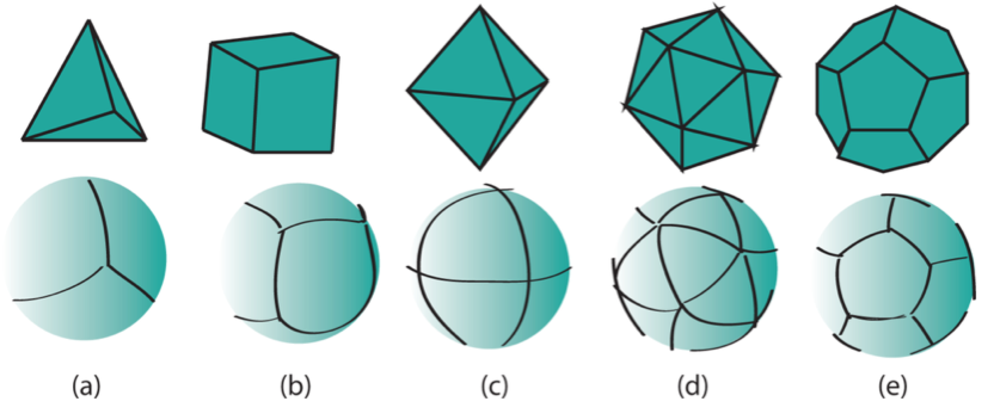
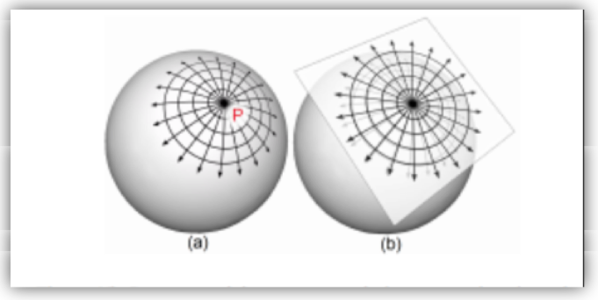
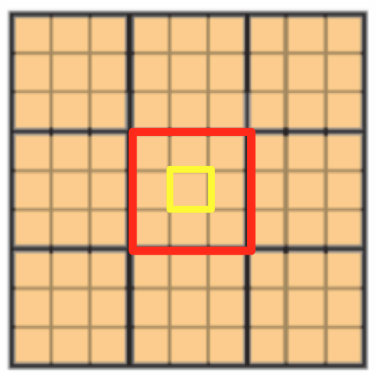
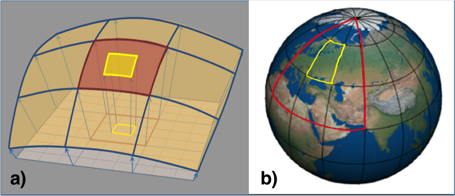
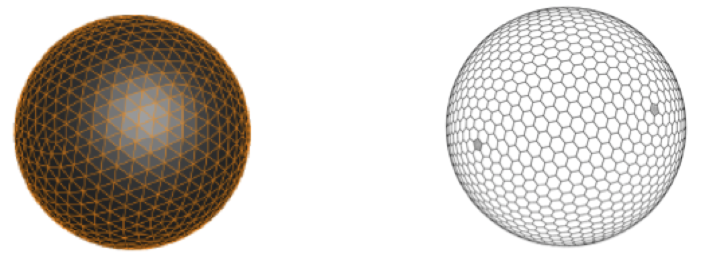
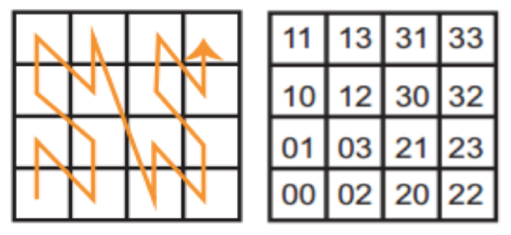

.Preface

This document specifies the core of an OGC Discrete Global Grid System Abstract Specification.

The intention of this Abstract Specification is to provide the geomatics and decision-making community with a formal document with which DGGS can be recognized, designed, built and used. This Abstract Specification defines the framework components that make up a compliant DGGS and the variability within those components. The value of a DGGS as a spatial reference system is also discussed, as is the opportunity to interoperate between other DGGS and to utilize other OGC/ISO standards within the implementation of DGGS. As with any spatial reference, and especially an approach that is early in adoption, intellectual property rights pertaining to various methods of creating and using DGGS should be expected. For example, there exist multiple patents for indexing DGGS, and the implementers of this Abstract Specification should make themselves aware of these patents.

Attention is drawn to the possibility that some of the elements of this document may be the subject of patent rights. The Open Geospatial Consortium shall not be held responsible for identifying any or all such patent rights.

_Recipients of this document are requested to submit, with their comments, notification of any relevant patent claims or other intellectual property rights of which they may be aware that might be infringed by any implementation of the Abstract Specification set forth in this document, and to provide supporting documentation._

[abstract]
== Abstract

This document specifies the core Abstract Specification and extension mechanisms for Discrete Global Grid Systems (DGGS). _A DGGS is a spatial reference system that uses a hierarchical tessellation of cells to partition and address the globe. DGGS are characterized by the properties of their cell structure, geo-encoding, quantization strategy and associated mathematical functions._ The OGC DGGS Abstract Specification supports the specification of standardized DGGS infrastructures that enable the integrated analysis of very large, multi-source, multi-resolution, multi-dimensional, distributed geospatial data. Interoperability between OGC DGGS implementations is anticipated through implementation standards, and extension interface encodings of OGC Web Services.

[.preface]
== Submitters

All questions regarding this submission should be directed to the editor or the submitters:

[%unnumbered]
|===
h| Name h| Affiliation
| Matthew Purss | Geoscience Australia
| Robert Gibb | Landcare Research New Zealand
| Faramarz Samavati | University of Calgary
| Perry Peterson | PYXIS
| J Andrew Rogers | SpaceCurve
| Jin Ben | Zhengzhou Institute of Surveying & Mapping
| Clinton Dow | ESRI

|===

Roger Lott's significant contribution is acknowledged for his eleventh-hour assistance in working through the relationship between DGGS concepts and ISO concepts and for ensuring the document structure complies with both OGC and ISO requirements.

[.preface]
== Introduction

A Discrete Global Grid System (DGGS) is designed as a framework for information as distinct from conventional coordinate reference systems originally designed for navigation. For a grid based global spatial information framework to operate effectively as an analytical system it should be constructed using cells that represent the surface of the Earth uniformly. This ensures that, at multiple resolutions, each cell has an equal probability of contributing to an analysis. A DGGS is a spatial reference system that uses a hierarchy of equal area tessellations to partition the surface of the Earth into grid cells or their analogous lattice points. In this way information recorded about phenomena at a location can be easily referenced to the explicit area of the associated cell, integrated with other cell values, and provides statistically valid summaries based on any chosen selection of cells. With equal area partitioning, spatial analysis can be replicated consistently anywhere on the Earth independent of resolution or scale.

OGC DGGS reference systems are polyhedral reference systems on the surface of a base unit polyhedron's circumscribed ellipsoid. The base unit polyhedron's location and orientation is defined in Earth Centered (EC) coordinates. The initial equal area tessellation of the chosen ellipsoidal Earth model is achieved by scaling a unit polyhedron of defined orientation until its vertices all touch the ellipsoid and connecting adjoining vertices with arcs selected from the set of permitted arcs, the simplest of which are geodesic, small circle or small ellipse arcs. Appropriate differential scaling is applied to the unit polyhedron to ensure an equal area initial tessellation. For the simple case of regular polyhedra and geodesic (i.e. great circle) arcs on its circumscribed spheroid the scaling is uniform. <<fig1>> illustrates their simplest form using a regular spherical polyhedron with a spheroidal circumscribing ellipsoid and geodesic arcs. Small circle arcs are typically used to construct arcs along lines of latitude for both ellipsoids and spheroids. Both small circle and small ellipse arcs are formed from the intersection of a defined plane with the ellipsoid, and in that sense they can be considered equivalent to the 'straight' lines of 2D cell boundaries. More complex forms of straight line, such as arcs that project to a straight line in an equal area projection are also allowed.

[[fig1]]
.Regular polyhedra (top) and their corresponding initial equal area tessellation (bottom) (a) tetrahedron, (b) cube, (c) octahedron, (d) icosahedron and (e) dodecahedron. [111111, <<fig2>>]

There is a gap between conventional coordinate reference systems and the reference system needed to define DGGS.&nbsp;This OGC Abstract Specification fills the gap in existing OGC and ISO standard reference systems and establishes requirements for globally interoperable equal-area cell- or lattice-based information frameworks.

Existing spatial reference systems (e.g. ECEF [Earth Centered Earth Fixed], WGS 84 or Web Mercator) build grids from projected Cartesian or ellipsoidal coordinate axes. Rectangular planar grids are typically formed by establishing a set of regular ticks on a pair of linear axes with grids cells being formed by the intersection of straight lines drawn normal to the ticks on each axis. Analogous construction techniques can be used to create triangular or hexagonal grids. The properties of grids built this way arise from the premise of planar geometry and not the curved geometry of the surface of a sphere or ellipsoid. While these properties hold true at local scales, in curved geometries they increasingly fail at progressively larger regions of interest (see <<fig2>>). Take for example the assumption that a grid cell's geometric properties are independent of its size or resolution – which is implicit in constructing sets of planar aligned (or 'nested') 10m, 30m and 90m grids. As shown in <<fig3>>, a 90m square cell formed from nine 30m square child cells has the following properties:

. It is also square;
. Its edges are three times the edge length of its 30m child cells, which in turn all are three times the edge length of their 10m child cells;
. Its interior angles are all right angles and identical to the interior angles of all of the child cells;
. Its edges follow the shortest linear path between neighboring cell vertices; and,
. The angles or bearings from centroid to centroid between cells are preserved irrespective of the direction of travel. 

[[fig2]]
.Comparison of a grid (in this case radial) represented on both (a) curved and (b) planar surfaces. With increasing distance away from the point P there is an increasing deviation between the two representations of the grid [2, Fig. 15; 47, Fig. 3].

[[fig3]]
.planar square grid with nested child cells – the red and yellow cells have identical geometry, and in each case the geometry is also shared with all other cells of the same size.

On a curved surface, however, this is never the case, and yet we often make the same assumption; that all cells are geometrically identical in, for example, a country, or continental, wide mosaic comprising many satellite images. Consequently, under this paradigm assumption, choosing a fixed cell size for a global grid whose cells represent equal areas and seamlessly fit the earth's surface is therefore problematic. When this is required, conventional spatial standards enforce latitude-longitude axes to be used and these grids are therefore described in these spherical coordinates. But the cells of these types of (equal-angular) grids do not have the same properties of planar grids. <<fig4>> shows a similar consideration to that of <<fig3>>, only the grids are constructed using spherical instead of planar Cartesian coordinates. In this scenario, the largest (parent) cell does not necessarily have the same shape or internal angles as the child cells. Also, its edges do not follow the shortest linear path from corner to corner. Bearing directions between cell centroids, however, are preserved in both planar and curved geometry spaces.

[[fig4]]
.a) square grid on a portion of a sphere with nested child cells (projected from the planar grid shown in <<fig3>>), b) Lat-Lon (equal angular) grid, the red cell is 30^o^ x 30^o^ and has nine 10^o^ x 10^o^ child cells (the central child cell is shown in yellow). The geometries and spatial properties of each cell on curved grids are not shared as they are in the planar grid.
 

In an attempt to address this dichotomy, conventional spatial standards therefore support either small local well-behaved planar grids or global grids that preserve bearings and angular lengths, and do not preserve area; but not both at the same time. This OGC Abstract Specification fills this gap by providing a formal specification for area preserving reference systems based on the surface model of the Earth that respect the accuracy and precision of spatial data at all scales from local to global. These systems use a hierarchical tessellation of the entire Earth to produce equal-area grids. <<fig5>> shows two examples. We anticipate that future extensions of the DGGS Core will support higher dimensions, such as the volume of the Earth and its atmosphere, and the Earth through time.

[[fig5]]
.Tessellations of the Earth to equal-area cells. Left: Triangular cells. Right: Hexagonal cells with twelve pentagonal cells at the vertices of the initial tessellation
 

The language and foundations of current geospatial standards are deeply rooted in planar thinking, so while this OGC Abstract Specification leverages as much as it can from existing standards, it also introduces new concepts that are subtly yet fundamentally different from those described by the standards that it draws from. These subtle differences do challenge our thinking. As a consequence, this OGC Abstract Specification is an evolution of both existing raster processing practice and past usage of discrete global grids.

As a specification for an area preserving earth reference system this OGC Abstract Specification defines more than just grids and lattices. The underlying geometry of the cells and the topological relationships between neighboring cells can be used to define globally unique identifiers (GUIDs) for the cells at any resolution.

Earlier we noted that planar grids are formed from the pairs of axes each with regular ticks corresponding to the cell dimension, facilitating a simple topological referencing schema for each cell (usually via a matrix style index for each cell along the axes of the grid – i.e. rows and columns for a 2D grid). With DGGS we introduce a more sophisticated set of cell referencing schemas; such as, space filling curves that traverse all the cells in a manner that is functionally equivalent to the axes. As shown in <<fig6>>, cell indices are assigned to cells along the path of the space filling curve. These indices together with the geometry of the space filling curve carry the metrics of the curved surface and the topological relationships between neighboring cells. The cell indices are explicitly treated as GUIDs.

[[fig6]]
.Using Morton space filling curve for defining labels of 4x4 square cells. (after [2, Fig. 25])

The mathematical properties of integers and real numbers on axis pairs in a plane are known implicitly and are therefore not part of any OGC specification for planar grids. The theoretical basis on which the separate disciplines for space filling curves, GUIDs, grids, spatial topology and DGGs are also well founded; however, their roles in a global reference frame defined through DGGS are not implicitly understood. This OGC Abstract Specification therefore defines these roles and relationships explicitly. This is a necessary departure from previous DGGS work that is needed to ensure a robust spatial reference frame standard. A brief history of DGGS is provided in Annex B for reference.