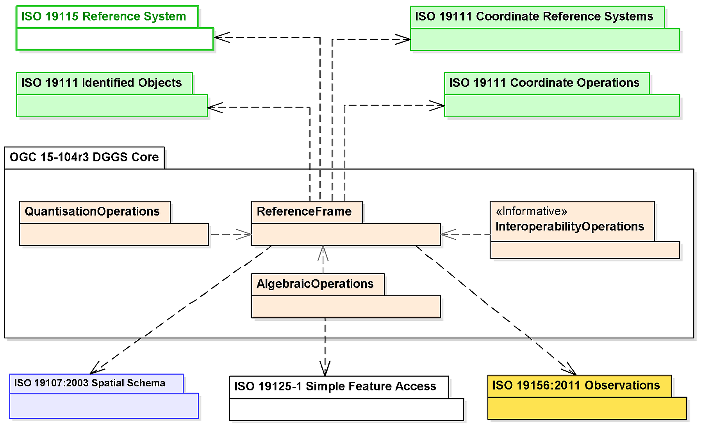
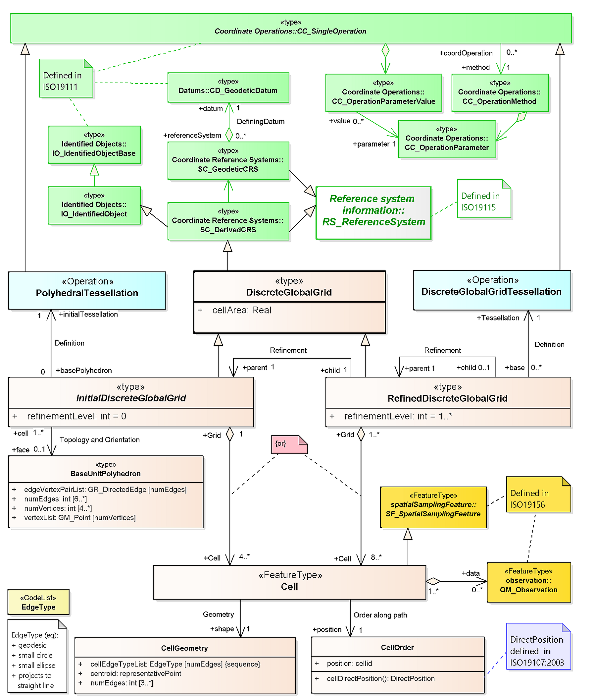
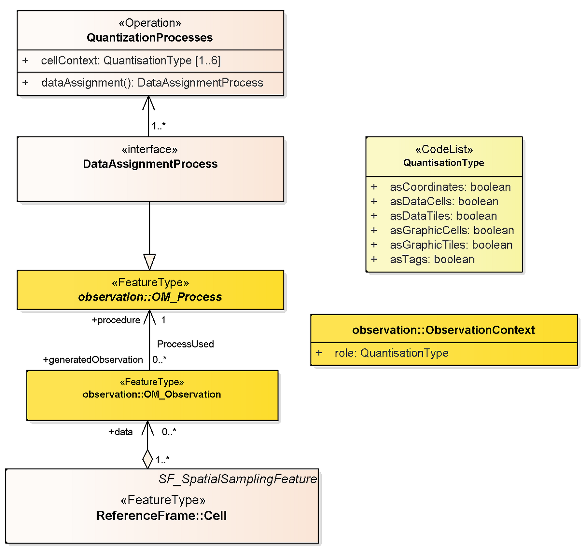
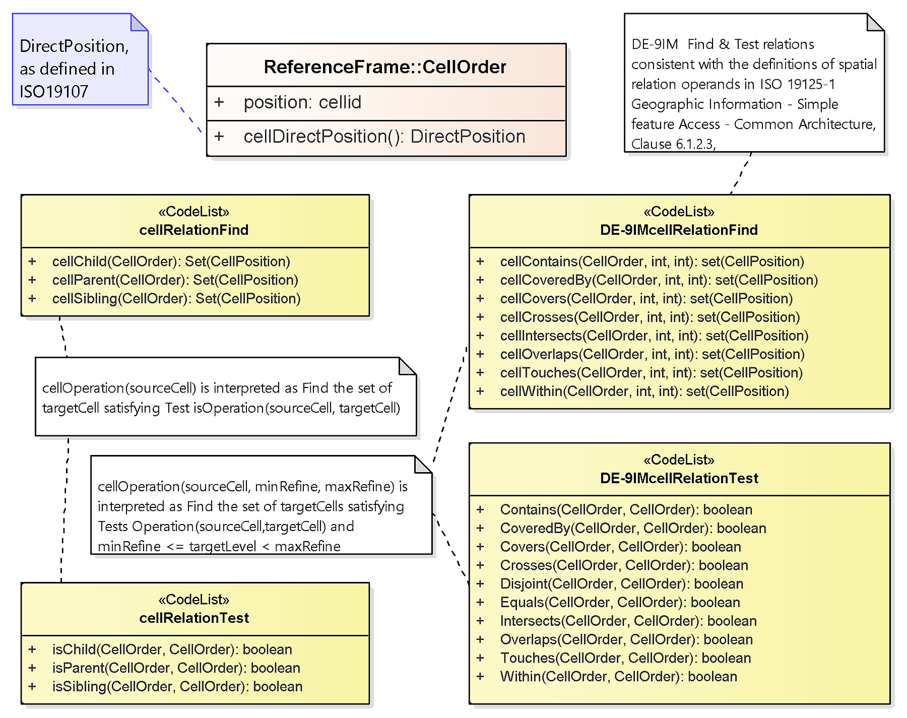
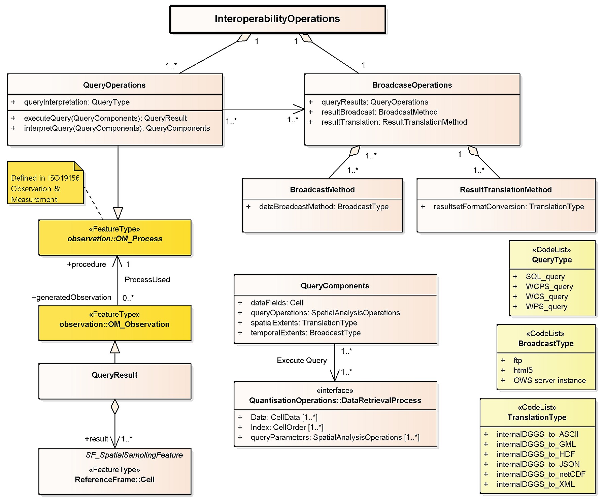

== DGGS Core Data Model (normative) 

This Clause specifies the underlying data model and core requirement class for a DGGS specification.

[%unnumbered]
|===
2+h| Requirements Class - Core
2+| http://www.opengis.net/spec/DGGS/1.0/req/core[http://www.opengis.net/spec/DGGS/1.0/req/core]
| Target type | Conceptual Specification

|===

=== DGGS Core Data Model Overview

For an Earth grid system to be compliant with this Abstract Specification it must define a hierarchical tessellation of equal area cells that both partition the entire Earth at multiple levels of granularity and provide a global spatial reference frame. The system must also include encoding methods to: address each cell; assign quantized data to cells; and perform algebraic operations on the cells and the data assigned to them.

<<fig7>> shows the packages comprising a DGGS with the core elements grouped into the two (2) main components of:

[type=a]
. reference frame elements, and,
. functional algorithm elements; comprising:
.. quantization operations, 
.. algebraic operations, and 
.. interoperability operations.

[[fig7]]
.DGGS Core Conceptual Data Model

[%unnumbered]
|===
h| Requirement 1
| http://www.opengis.net/spec/DGGS/1.0/req/core/model[http://www.opengis.net/spec/DGGS/1.0/req/core/model]
| _A DGGS specification SHALL include a DGGS Reference Frame and the associated Functional Algorithms as defined by the DGGS Core Conceptual Data Model._

|===

=== DGGS Reference Frame Elements

The reference frame of a DGGS consists of the fixed structural elements that define the spatial framework on which the DGGS functional algorithms operate. The following sub-clauses define the core requirements for an Earth grid system to be considered a DGGS.

[[fig8]]
.DGGS Reference Frame Class diagram

<<fig8>> shows the class structure for the reference frame of a DGGS specification and how the classes relate to each other.

==== Global Domain

For an Earth grid system to be considered a DGGS specification it must be defined over the entire surface of the Earth, representing the DGGS Domain. As defined by Goodchild [9] global domain is achieved when the areal cells defined by the grid _"exhaustively cover the globe without overlapping or underlapping"._

[%unnumbered]
|===
h| Requirement 2
| http://www.opengis.net/spec/DGGS/1.0/req/core/reference_frame/domain/area[http://www.opengis.net/spec/DGGS/1.0/req/core/reference\_frame/domain/area]
| _Domain completeness – the DGGS Domain of the initial discrete global grid SHALL cover the entire globe._

|===

[%unnumbered]
|===
h| Requirement 3
| http://www.opengis.net/spec/DGGS/1.0/req/core/reference_frame/domain/overlap[http://www.opengis.net/spec/DGGS/1.0/req/core/reference\_frame/domain/overlap]
| _Position uniqueness – the initial discrete global grid SHALL be defined without any overlapping DGGS Cells._

|===

==== Tessellation Sequence

Unlike a single resolution spatial grid, a DGGS must define multiple discrete global grids forming a system of hierarchical tessellations each with progressively finer spatial resolution, each related by Cell Refinement methods.

[%unnumbered]
|===
h| Requirement 4
| http://www.opengis.net/spec/DGGS/1.0/req/core/reference_frame/tessellation_sequence[http://www.opengis.net/spec/DGGS/1.0/req/core/reference\_frame/tessellation\_sequence]
| _A DGGS specification SHALL comprise a sequence of discrete global grid tessellations representing multiple spatial resolutions_

|===

==== Area Preservation

Preservation of total surface area throughout the range of hierarchical tessellations is a necessary property of DGGS in order to represent information consistently at successive resolutions. This requirement ensures that each level of grid refinement completely covers the globe without cell overlaps.

[%unnumbered]
|===
h| Requirement 5 
| http://www.opengis.net/spec/DGGS/1.0/req/core/reference_frame/area_preservation[http://www.opengis.net/spec/DGGS/1.0/req/core/reference\_frame/area\_preservation]
| _For each successive level of grid refinement, a DGGS specification SHALL preserve Domain completeness and position uniqueness._

|===

==== Cell Structure

Cell structure is an important aspect of any DGGS. Each cell can be considered to be an ellipsoidal polygon on the surface model of the Earth, for which several different cell shapes can be used. Each cell shape has its own advantages and disadvantages [2] (e.g. hexagonal cells are optimized for high fidelity sampling [2, 10], while triangular cells enable fast access and visualization) and it is usually desired for each grid refinement of a DGGS to have a majority of cells with the same shape [10, 11]. Triangular, quadrilateral and hexagonal cells are common choices used in DGGS. These shapes provide regular tiling of the plane [10], which can be mapped to a curved surface such as the surface model of the Earth.

The cell structures in each successive level of cell refinement are constrained by the properties of the initial tessellation, but do not necessarily have the same geometry as the initial tessellation.

===== Simple Cells

For DGGS a specification to have cells which completely cover the surface of the Earth without any gaps or overlaps it is necessary for the shape of all cells defined by the DGGS Domain to be simple polygons on the surface model of the Earth. Simple polygons have the following properties:

[type=a]
. Edges that meet only at the vertices;
. Exactly two edges meeting at each vertex; 
. Exactly the same number of edges and vertices; and,
. Enclosing a region which always has a measureable area.

The cell shapes derived from the five (5) Platonic solids and (13) Archimedean solids (triangle, quadrilateral, pentagon, hexagon, and octagon) are all simple polygons that satisfy this requirement.

[%unnumbered]
|===
h| Requirement 6
| http://www.opengis.net/spec/DGGS/1.0/req/core/reference_frame/cell/shape[http://www.opengis.net/spec/DGGS/1.0/req/core/reference\_frame/cell/shape]
| _For each successive level of grid refinement, a DGGS specification SHALL define DGGS Cells that are simple polygons._

|===

===== Equal Area Cells

This Abstract Specification defines DGGS as an Earth Reference System based on a hierarchy of equal area tessellations. Equal area cells provide global grids with spatial units that (at multiple resolutions) have an equal probability of contributing to an analysis. Equal area cells also help to minimize the confounding effects of area variations in spatial analyses where the curved surface of the earth is the fundamental reference frame.

By equal area we refer to the 'derived SI unit' of area as it is applied to the surface model of the earth within the boundary of defined by a DGGS cell. This is not an absolute value and is dependent on the precision (or uncertainty) of the tessellation of the Earth's surface model (and the uncertainty of the Earth model itself). Just as a unit of length is dependent on the precision by which it is measured - for example, within the respective levels of precision, 1 meter can be correctly and accurately described as both:

[type=a]
. 1/10,000,000 of the meridian through Paris between the North Pole and the Equator (+/- ~10^-4^ m) [original SI definition of 1m], and, 
. The length of the path travelled by light in a vacuum in 1/299,792,458^th^ of a second (+/- 10^-10^ m) [current SI definition of 1m].

This is despite the precision of both representations being 6 orders of magnitude different.

For DGGS cells constructed to approximate equal area but derived in other ways, we require that the cell refinement method be iterative, regular and predictably convergent on equal area.

In any specification of a DGGS, there will be a practical limit to the computational precision that is acceptable for that specification. This precision is represented as the ratio of DGGS cell area uncertainty to DGGS cell area. The DGGS cell area uncertainty may arise for example from the number of iterations undertaken in any iteratively converging calculation, the rate of convergence, the number of bits in the underlying computer's CPU or storage architecture, or the precision of critical real values such as π, and the parameters defining the DGGS reference frame.

DGGS may validly comprise more than one cell geometry. This most typically arises for systems based on truncated polyhedra such as the cuboctahedron – with both square and triangular faces, and the truncated icosahedron – with pentagonal and hexagonal faces. In these situations equal area is interpreted to mean that all the cells of a particular geometry are equal area, and that the ratio of the areas of the two geometries is preserved through the tessellations. For example in the truncated icosahedron used by ISEA the ratio of pentagonal to hexagonal areas within a tessellation level is always 5/6.

[%unnumbered]
|===
h| Requirement 7 
| http://www.opengis.net/spec/DGGS/1.0/req/core/reference_frame/cell/equal_area_precison%20[http://www.opengis.net/spec/DGGS/1.0/req/core/reference\_frame/cell/equal\_area\_precison]
| _For each successive level of grid refinement, a DGGS specification SHALL specify a DGGS equal area precision that represents the maximum allowed ratio of cell area uncertainty to cell area_

|===

[%unnumbered]
|===
h| Requirement 8
| http://www.opengis.net/spec/DGGS/1.0/req/core/reference_frame/cell/equal_area[http://www.opengis.net/spec/DGGS/1.0/req/core/reference\_frame/cell/equal\_area]
| _For each successive level of grid refinement, and for each cell geometry, a DGGS specification SHALL define DGGS Cells that are equal area (or iteratively and predictably converge on equal area) within the specified level of precision_

|===

==== Tessellations

A multiresolution hierarchical tessellation of cells is created by constructing a sequence of discrete global grids, each with successively finer DGGS Cell resolutions. First an initial discrete global grid is constructed as described in sub-clause 6.2.5.1. The cells of this initial tessellation are then iteratively refined by application of cell refinement method(s) [2] to create finer resolution child cells. The initial tessellation, the cell shape, the refinement methods and indexing methods may all vary for different DGGS.

===== Initial Tessellation

The entire globe must be partitioned to a finite/discrete set of regions. Most methods initially approximate the globe using a simple base unit polyhedron which is scaled so that all vertices are located on the surface model of the Earth. The shortest path along that surface are then mapped to produce an initial discrete global grid tessellation of the same general form as the chosen base unit polyhedron. Each DGGS Cell of the initial tessellation represents one face of the chosen base unit polyhedron mapped to the chosen surface model of the Earth. This Abstract Specification refers to this initial tessellation as the "polyhedral tessellation". The most common choices for an initial base unit polyhedron are discussed in sub-clause B.4 [22].

[%unnumbered]
|===
h| Requirement 9 
| http://www.opengis.net/spec/DGGS/1.0/req/core/reference_frame/cell/initial_tessellation[http://www.opengis.net/spec/DGGS/1.0/req/core/reference\_frame/cell/initial\_tessellation]
| _A DGGS specification SHALL include an initial tessellation that is defined by equal area cells produced by mapping a base unit polyhedron to the surface model of the Earth._

|===

===== Tessellation by Cell Refinement

To support multiple spatial resolutions, a series of increasingly finer resolution tessellations are needed [11]. Each successive resolution is generated from its parent by recursive application of one or more refinement methods. Each refinement method is categorized according to parent cell shape(s), child cell shape(s) – often the same as the parent shape, parent-child alignment, rotation and refinement ratio [2]. This Abstract Specification refers to tessellation by cell refinement as the "Discrete Global Grid tessellation". Theoretically there are an infinite number of cell refinements that can be implemented on a DGGS; however, as a best practice it is recommended {blank}footnote:[Elaboration of this and other “Best Practices” in the construction of conformant DGGS implementations will be included in a forthcoming “Best Practice” document to be published by the DGGS SWG following adoption of this Standard.] that a DGGS specification should specify a maximum number of refinements that considers the particular use-case and the limitations in spatial resolution and precision of the Earth model used by the DGGS Reference Frame.

[%unnumbered]
|===
h| Requirement 10 
| http://www.opengis.net/spec/DGGS/1.0/req/core/reference_frame/cell/refinement[http://www.opengis.net/spec/DGGS/1.0/req/core/reference\_frame/cell/refinement]
| _A DGGS specification SHALL have a method to refine parent cells into finer resolution child cells._

|===

===== Cell Addressing

Cell addresses, or indices, for DGGSs are derived from four general indexing methods: hierarchy-based, space-filling curve based, coordinate [1] and encoded address schemas (such as those used for IP addresses [12]). The use of labels as geographic identifiers might also achieve an acceptable addressing if DGGS operations can be maintained. Under this Abstract Specification each cell of a DGGS specification must have a unique cell address assigned using one or more of these methods.

[%unnumbered]
|===
h| Requirement 11
| http://www.opengis.net/spec/DGGS/1.0/req/core/reference_frame/cell/addressing[http://www.opengis.net/spec/DGGS/1.0/req/core/reference\_frame/cell/addressing]
| _A DGGS specification SHALL_ use _a spatial referencing method to assign a unique spatial reference (or index) to each DGGS cell across the entire DGGS Domain._

|===

==== Spatial Referencing 

Spatial referencing (or geo-encoding) is achieved by addressing an identifier – an index or geographic identifier – to each DGGS cell. The cell address must be unique across the entire domain of hierarchical tessellations of the DGGS.

[%unnumbered]
|===
h| Requirement 12 
| http://www.opengis.net/spec/DGGS/1.0/req/core/reference_frame/spatial_reference[http://www.opengis.net/spec/DGGS/1.0/req/core/reference\_frame/spatial\_reference]
| _A DGGS specification SHALL define a unique index to address each cell across all defined spatial resolutions_

|===

===== Cells Referenced at their Centroid

Each DGGS Cell must be referenced at its centroid. This is because the centroid is the only location that will provide a systematic and consistent spatial reference point for all cells regardless of their shape.

To demonstrate this, consider that we have a DGGS constructed with square/rectilinear shaped cells and one of the cell vertices (say the top left-hand corner) is chosen as the primary spatial reference location for that cell, and the method of cell refinement is aligned (i.e. no cell rotation throughout successive levels of grid refinement). In this case, the method and schema required to define a vertex as the primary spatial reference location is simple, intuitive and requires less work to define than, for example, computing the geodesic cell centroid. However, if the cells are rotated as part of the grid refinement schema then you would need to add the complexity of determining which vertex will be deemed the 'top left-hand corner' of successive 'rotated' levels of refinement; again, this is only a little more complex but now the schema is tailored to a particular type of DGGS specification. Further, if we wish to apply a similar vertex focused referencing schema to a triangular or hexagonal structured DGGS how would we easily and systematically define which vertices are equivalent to the 'top left-hand corner' in the rectilinear case. And for each new style of tessellation and refinement schema there would need to be an individual schema established to assign the primary vertex for the spatial reference. By contrast the geodesic centroid location is calculated using the same mathematical algorithm regardless of the shape of the cell and is not affected by changes in cell orientation throughout the DGGS Domain.

The centroid location is calculated as the geodesic center of surface area of a DGGS cell. The centroid enables a dual representation of a DGGS tessellation as both n-dimensional areal cell grids and as point-based lattices of cell reference locations.

[%unnumbered]
|===
h| Requirement 13 
| http://www.opengis.net/spec/DGGS/1.0/req/core/reference_frame/spatial_reference/cell_center[http://www.opengis.net/spec/DGGS/1.0/req/core/reference\_frame/spatial\_reference/cell\_centroid]
| _A DGGS specification SHALL define the location of a DGGS Cell reference to be the centroid of each cell._

|===

=== DGGS Functional Algorithms

The ability to locate and perform algebraic operations on data assigned to a DGGS is critical for a DGGS specification. Additionally, it should support connectivity and hierarchical operations on cells. As a minimum, a DGGS specification must include definitions for:

. Quantization Operations – Assigning and retrieving data to and from cells;
. Algebraic Operations –Performing algebraic operations on cells and the data assigned to them and cell navigation; and
. Interoperability Operations – Translating cell addresses to other Coordinate Reference Systems (CRS), such as a conventional latitude-longitude.
 
==== Quantization Operations

A DGGS is defined based on the geometry of the globe in a data agnostic manner. Therefore, a DGGS specification must define mechanism for assigning data to cells and retrieving data from cells. Different quantization strategies may be used for sampling content into cells. For example, a single DGGS may be used as a data structure for integrating multiple datasets of different types (e.g. vector and raster datasets) [11] and in different ways (e.g. DGGS cells as data tiles, or one raster pixel per DGGS cell or DGGS cell indices as vector coordinate-pairs). This Abstract Specification makes use of the concepts defined by the Observations and Measurements abstract standard [ISO 19156:2011(E)] to facilitate the association of observations/spatial data to a DGGS cell(s). Some DGGS/polyhedron choices are more efficient for sampling (e.g. DGGS based on an icosahedron).

Multiple observation contexts are recognized for quantization, each corresponding to a distinct role for DGGS Cells to play. In any particular DGGS specification, one or more (and potentially all) roles may be described for either internal or external use to support interoperability, as follows.

. Data Tiles:
** In Data Tile quantization, spatial feature/observations (e.g. point clouds, images, vectors, etc.) are aggregated and clipped to cell boundaries and stored in tiles without any changes made to the feature type parameters. The cells of the DGGS provide a multi-, or single-, resolution tiling schema with the cell index used as the identifier in the tile naming convention. In the context of "Big Data Analytics" 'asDataTile' support will likely be the most efficient type of granularity for job submission on HPC/HPD or Cloud ICT infrastructure; particularly for embarrassingly parallel analyses. It is also likely to be the most efficient granularity for many data transfer requests.
. Data Cells:
** In Data Cell quantization, the spatial features/observations (e.g. point clouds, images, vectors, etc.) are sampled to each DGGS Cell by assignment of data value(s) using the cell's geometry to govern the quantization operation.
. Coordinates:
** In coordinate quantization, each coordinate tuple from the spatial feature/observation is converted to a cell index of an appropriate level of precision. The cell data package will include appropriate vector topology to preserve the structure of the spatial feature in the context of the DGGS.
. Tags:
** In Tag quantization, cell index values are "tagged" to data objects in a similar fashion to social media records. The refinement level of the cell index is indicative of the precision with which the location of a spatial feature/observation and/or its spatial extent are known. This can be thought of as a convex hull with the same geometry of the DGGS Cell surrounding the objects to be assigned to that cell. 
. Graphic Cells:
** In Graphic Cell quantization, data is rendered to cells, and refinement levels are leveraged to support corresponding levels of detail or zoom levels.
. Graphic Tiles:
** In Graphic Tile quantization, graphic cells are tiled, and often cached for delivery to a display system. As with data Tiles, the cell index is used as the identifier in the tile naming convention.

The data assigned to a particular DGGS implementation defines its DGGS Extent and will vary over its lifecycle as the amount of data assigned to it changes. The DGGS Domain, however, must always be fixed and be defined over the entire surface model of the Earth.

[[fig9]]
.DGGS Quantization functional algorithm class diagram

<<fig9>> shows the key functional algorithm elements required to perform data quantization operations in a DGGS specification.

[%unnumbered]
|===
h| Requirement 14
| http://www.opengis.net/spec/DGGS/1.0/req/core/methods/quantization[http://www.opengis.net/spec/DGGS/1.0/req/core/methods/quantization]
| _A DGGS specification SHALL define quantization methods for assigning data to DGGS cells and retrieval methods for reading data from DGGS cells._

|===

==== Algebraic Operations

A DGGS specification must include methods to support analytic and algebraic processes on the data assigned to it across its entire domain. There are two key classes of operations that support this:

. Cell Navigation Operations – supporting navigation operations through both parent-child DGGS Cell relationships and neighbourhood associations across the entire DGGS Domain; and,
. Spatial Analysis Operations – supporting spatial analysis operations using DE-9IM to determine the spatial relationships between DGGS Cells and spatial query objects.

These two classes of operators facilitate the hierarchical and spatial queries necessary to retrieve data from DGGS cell(s). Further algebraic and analytic processes may then be applied to the returned data through additional software bindings. This Abstract Specification does not specify any requirements for the binding or implementation of further, extension, algebraic or analytic processes. 

[[fig10]]
.DGGS Algebraic Operations functional algorithms class diagram

<<fig10>> shows the key classes of algebraic operations required by a DGGS specification.

[%unnumbered]
|===
h| Requirement 15
| http://www.opengis.net/spec/DGGS/1.0/req/core/methods/algebraic_processes/cell_navigation[http://www.opengis.net/spec/DGGS/1.0/req/core/methods/algebraic\_processes/cell\_navigation]
| _A DGGS specification SHALL define functions/methods to perform both hierarchy and neighbourhood navigation operations across its entire domain._

|===

[%unnumbered]
|===
h| Requirement 16
| http://www.opengis.net/spec/DGGS/1.0/req/core/methods/algebraic_processes/spatial_analysis[http://www.opengis.net/spec/DGGS/1.0/req/core/methods/algebraic\_processes/spatial\_analysis]
| _A DGGS specification SHALL define functions/methods to perform simple spatial analysis operations across its entire domain._ _[ISO 19125-1:2004__]_ _SHALL be used as a basis for specifying the spatial relationship operands that support these functions._

|===

==== Interoperability

While the quantization and algebraic functional algorithms enable a DGGS implementation to successfully operate internally; in order to facilitate connectivity with other spatial data infrastructures additional interoperability operations/methods are required. As a minimum, these interoperability operations must include functions to:

[type=a]
. Interpret and translate external data queries and/or process commands sent to the DGGS implementation; and,
. Convert the result set returned from a DGGS data operation from internal data format(s) (optimized for that DGGS implementation) to format(s) suitable for external data delivery.

This document does not specify the specific interface protocol encodings required to connect a DGGS implementation to an external client and facilitate the transfer of information into and out of a DGGS. This Abstract Specification makes use of the tools available in the Observations and Measurements Standard [ISO 19156:2011(E)] to facilitate the linkage between external query operations and the data/observations assigned to the DGGS cell(s) of interest. Specific interface encodings are anticipated to be elaborated as extensions to this Abstract Specification.

===== External Query/Process Interpretation

External queries and processes may originate from an external client application and range in syntax from "natural language queries" (e.g. 'Where are the gas pipelines in Western Canada located?', or, 'How has the Murray-Darling Basin in Australia changed over the past 27 years?', or 'Compute the watershed area of the Kawarau Catchment in New Zealand'), to an OWS 'GetCapabilities' or similar type of query, to an SQL (or similar) statement. To support interoperability, a DGGS specification must define methods to receive, interpret and translate an external data query (or process) request into a form that can be processed by the internal DGGS data retrieval algorithms and/or algebraic operations.

[[fig11]]
.DGGS Interoperability Operations functional algorithm class diagram
 

<<fig11>> shows on the left hand side the key functional algorithm elements required for DGGS to translate and execute a external query or process operations.

[%unnumbered]
|===
h| Requirement 17
| http://www.opengis.net/spec/DGGS/1.0/req/core/methods/interoperability/query[http://www.opengis.net/spec/DGGS/1.0/req/core/methods/interoperability/query]
| _A DGGS specification SHALL define a method, or functional algorithm, to read, interpret and execute an external data query._

|===

===== Query/Process Result Broadcasting

Just as it is necessary for DGGS to be able to interpret and execute external data queries, DGGS must also be able to broadcast results from data queries to external client(s) or data infrastructure(s). External clients are anticipated to be web-based client(s), software client(s) on the same ICT infrastructure as the DGGS, or even other DGGS.

<<fig11>> shows on the right hand side the basic elements required to translate the result set(s) returned from a DGGS data query into a suitable data format for transfer and broadcast the reformatted result set via one or a number of data/information transfer protocols {blank}footnote:[Specific DGGS interoperability Interface Protocols will be elaborated in a series OGC Extension
Standard documents to this standard.].

[%unnumbered]
|===
h| Requirement 18
| http://www.opengis.net/spec/DGGS/1.0/req/core/methods/interoperability/broadcast[http://www.opengis.net/spec/DGGS/1.0/req/core/methods/interoperability/broadcast]
| _A DGGS specification SHALL define a method, or functional algorithm, to translate data query/process results from internal DGGS data structures to standard data formats and to transmit/broadcast the reformatted result set via standard data transfer protocols._

|===
