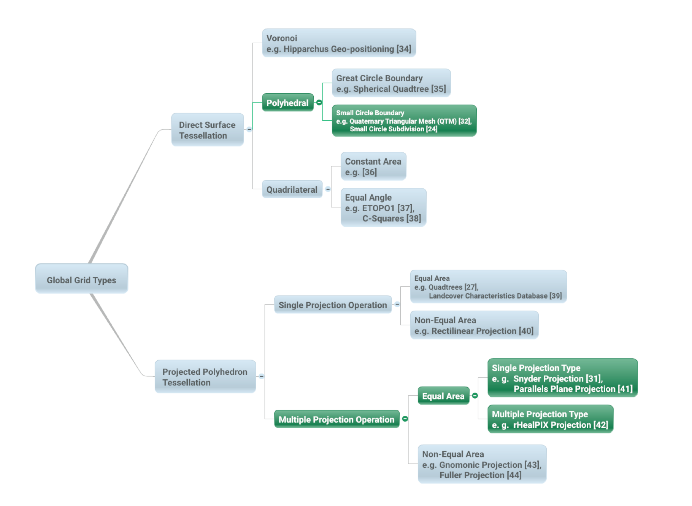
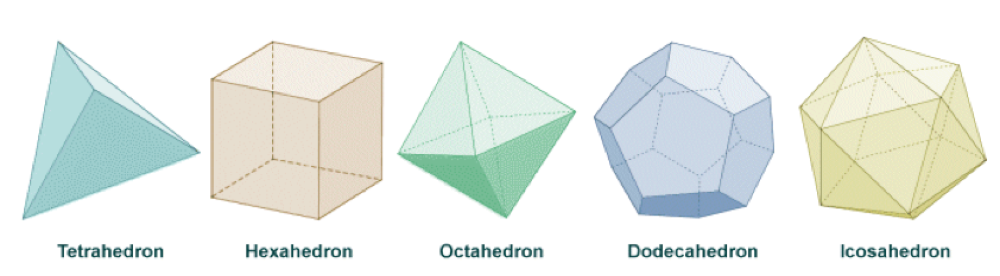
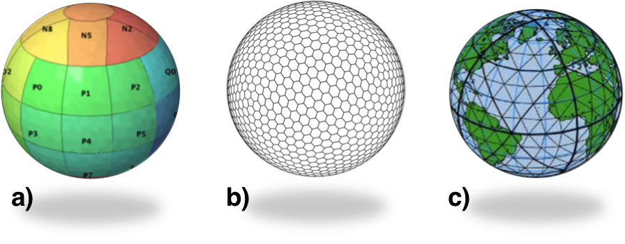

[appendix,obligation=informative]
== Background to DGGS

=== DGGS as a Digital Information Medium

Conventional coordinate reference systems address the globe with a continuous field of points suitable for repeatable navigation and analytical geometry. While this continuous field is represented on a computer in a digitized and discrete fashion by tuples of fixed-precision floating point values, it is a non-trivial exercise to relate point observations spatially referenced in this way to areal features on the surface of the Earth. In contrast, a DGGS is designed to be an information grid not a navigation grid. DGGS provide a fixed areal based geospatial reference frame for the persistent location of measured Earth observations, feature interpretations, and modelled predictions. DGGS address the entire planet by partitioning it into a discrete hierarchical tessellation of progressively finer resolution cells. The geometry and location of the cell is the principle aspect of a DGGS. Data integration, decomposition, and aggregation is optimized in the DGGS hierarchical structure and can be exploited for efficient multi-source data processing, storage, discovery, transmission, visualization, computation, analysis, and modeling.

=== History

The concept of using polyhedra to model the surface of the Earth is by no means new. In 1509 Lucia Pacioli published "De Devina Proportione" [14] a treatise, illustrated by Leonardo Da Vinci, exploring the mathematical characteristics of the 'golden ratio' (also referred to as the 'divine proportion') which included a consideration of the properties of the five platonic solids circumscribed within the sphere and the eminent role of the 'golden ratio' in the construction of two of them (the icosahedron and dodecahedron). It is likely that his time studying with Pacioli influenced Da Vinci's later thinking regarding spherical geometry; evidenced in 1515 by his derivation of the octahedral analysis of the volume of a sphere with various forms of segmentation [15]. This work is suggested to have led to the development of the Reuleaux triangular formulation of the world map (or _mappamundi_), attributed to Da Vinci [16], and may be considered a precursor to differential calculus formally developed by Newton and Leibniz nearly two centuries later.

In the 1940's a similar approach was used by R. Buckminster Fuller in the development of the Dymaxion map of the world [17] – a physical model of the Earth mapped onto the planar faces of a polyhedron (first presented as a cuboctahedron [18] and then later as an icosahedron [19]). The aim of the Dymaxion map was to depict the spherical world as a flat surface with true scale, true direction and correct configuration all at the same time. Although a physical model of the Earth, and not strictly a DGGS, it inspired later researchers to produce digital Earth models; which in turn has led to the development of DGGS.

Formal development of DGGS began in the 1950s with the promising value of global analysis coinciding with the increased use of geographic information systems and the availability of global mapping data and positioning systems. Perhaps the first published instance of formalized discrete global grids with application to numerical analysis was described by Vestine _et. al._ [20] in 1955, where they define and use an equal-area grid based on the mapping of a spherical icosahedron onto the surface of the Earth as a framework to conduct areal based integral and spherical-harmonic analyses of the geomagnetic field. This grid was later used (and re-described) by Sadourny _et. al._ [21] in 1968 to model equations of atmospheric motion without distortion across the entire globe. Another style of discrete global grid, and perhaps the first application of hierarchical indexing schemas as an analytic cell referencing tool was implemented by Geoffrey Dutton in 1984 [22- 24] at the Laboratory for Computer Graphics and Spatial Analysis at Harvard Graduate School of Design. Dutton's first global grid was designed for assembling and managing global terrain data on a triangular global grid. His global geodesic elevation model (GEM) [22-25] started with a cuboctahedron connected into a rhombic dodecahedron (which is its dual polyhedron where the vertices of one corresponds to the center of the faces of the other) and recursively divided the initial 12 triangular faces into refinements of 9 partially nested equilateral triangles. Dutton refined GEM to use only an octahedral basis in the Quaternary Triangular Mesh (QTM) DGGS [22- 24, 26]. QTM is a fourfold hierarchical decomposition of facets of an octahedron into triangles whose edges follow small circles. Elevations were assigned to the centroids of child triangles and to the vertices that coincided with them. Waldo Tobler and Zi-tan Chen [27] imagined the primary purpose for a formal discrete global grid standard would be information exchange and storage. Tobler argued that as a generalized information medium _"…coverage must be uniform and that every element of area must have an equal probability of entering the system. This suggests that the world should be partitioned into chunks of equal size"_ [27]. Tobler's global grid started with a cube as a base unit polyhedron and divided into rectilinear quad-trees to create successive subdivisions with unlimited resolution. Dennis White, Scott Overton, and Jon Kimerling, driven by a need for a statistically valid sampling to integrate aquatic and terrestrial monitoring for the US-EPA, designed a global grid in 1989 using closely packed hexagonal cells that started with a truncated icosahedron as the base unit polyhedron [28].

=== Global Grid Taxonomy

There have been numerous methods proposed for achieving a tessellation of the Earth, each with varying degrees of area and/or shape distortion [29]. These tessellations can be organized into a limited set of categories that describe a hierarchical taxonomy of global grids (<<fig12>>) [29, 30]. In order for a global grid tessellation to be able to operate as a DGGS it must be able to produce equal area cells on the surface of the Earth [27]. Only two groups of classes of global grid achieve this [29]: those based on equal area mapping of a base unit polyhedron (such as the Icosahedral Snyder Equal Area [ISEA] projection [31]) and those based on direct surface tessellations using Small Circle Subdivision (e.g. [32, 33]).

[[fig12]]
.Global Grid Taxonomy (after Figure 4 from [29]). Direct Surface Tessellations can be achieved using the following classes of methods: Voronoi [34]; Polyhedral-Great Circle Boundary [35]; Polyhedral-Small Circle Boundary [32, 24]; Quadrilateral-Constant Area [36]; and, Quadrilateral-Equal Angle [37, 38]. Projected Polyhedron Tessellations can be achieved using the following classes of methods: Single Projection – Equal Area [27, 39]; Single Projection-Non-Equal Area [40]; Multiple Projections – Equal Area [31, 41, 42]; and Multiple Projection – non-Equal Area [43, 44]. Suitable classes of global grid tessellations for application in DGGS under this Abstract Specification are highlighted in green.

=== Criteria 

There are many possible DGGS, each with their own advantages and disadvantages. Criterion for a discrete global grid are well developed by both Michael F. Goodchild [9] and Jon Kimerling [29]; the foremost requirements being a tessellation of cells that exhaustively cover the globe with each cell having equal area and representing a single point. The points and cells of the various resolution grids which constitute the grid system form a hierarchy which displays a high degree of regularity [45]. Choices for an appropriate tessellation include properties of shape, adjacency, connectivity, orientation, self-similarity, decomposability, and packing properties. Cell choices generally are taken from the three shapes that uniformly tile a plane – rectilinear, triangular, and hexagonal cells.

While it is possible to map any polyhedral solid to the surface of the earth, the Platonic solids (tetrahedron, cube, octahedron, dodecahedron and icosahedron – see <<fig13>>) are the only polyhedral solids that perfectly partition the surface of a sphere into regular, equal area cells [46]. As a result, the Platonic solids are used in the construction of most equal area DGGS, often via a mapping of the polyhedral faces to the surface model of the Earth (some examples are shown in <<fig14>>). This method of mapping the faces of a base unit polyhedron to the surface model of the Earth creates a coordinate reference system that is based on a curved geometric framework. GIS and image analysis packages that assume flat earth geometries will need to adapt to support this new construct that more closely represents the earth.

[[fig13]]
.Representation of the five (5) Platonic solids: Tetrahedron, Hexahedron/Cube, Octahedron, Dodecahedron and Icosahedron.

[[fig14]]
.Examples of DGGS based on the mapping of the faces of Platonic solids to the surface model of the Earth: a) Rectilinear cells on rHealPIX projected hexahedron (rHealPIX DGGS after [41] Fig 2); b) Hexagonal cells on ISEA projected icosahedron (ISEA3H DGGS – courtesy of PYXIS Inc.); c) Triangular cells on a Quaternary Triangular Mesh of an octahedron (QTM – courtesy of Geffrey Dutton).

Any tessellation of the Earth does not necessarily produce a DGGS. Single resolution computational grids are not sufficient to constitute a DGGS. Spatial data structures used to organize map tiles or optimize rapid spatial search cannot be considered to qualify as a DGGS in and of themselves; although DGGS often utilize hierarchical indices to identify a cell, the primary feature of the DGGS is the cell geometry not the optimization of a spatial query. Further, DGGS have data independent geometry – their geometry is not formed to optimize a balanced search like R-Trees or maximal spacing of data as generated by Voronoi diagrams.

=== A Digital Spatial Reference System

One way to understand the important difference between a DGGS and a conventional spatial reference system is to consider that a DGGS provides a digital framework for geospatial information. Geospatial information is essentially a signal – that is some variable (e.g. measurement of phenomena) which changes subject to some other independent variable (e.g. spatial location, time, some physical interaction etc.…). Conventional geospatial data are analog signals as they reference to a continuous space – geographic coordinates on an ellipsoidal datum. Even the discrete pixels of a satellite Earth observation image reference this continuous analog model of Earth; however, these pixels do not observe precisely the same locational area for successive observations. Spatial reference by geographic identifier is described in ISO 19112. An OGC DGGS provides this globally in a structured form which is analogous to the ellipsoidal coordinate system described in ISO 19111 - spatial referencing by coordinates, but cell-based rather than continuous.

Sampling and quantization are necessary for a signal to be considered digital. As the name implies the DGGS provides the regular discrete intervals or cell partitioning to which location information (e.g. signal values) are sampled. A well-designed quantization strategy is also an important component of a DGGS that should maintain the fidelity of the original information in the values assigned to each cell. The discrete data values can be sampled from any geospatial data source independent of the original spatial reference, scale, format, type, frequency, or time. A DGGS is a discrete "digital" model of the Earth.

=== Application

As each cell in a DGGS is fixed in location, and the location provides an explicit area representation, basic geospatial enquiries, such as – "Where is it?", "What is here?", and "How has it changed?" – are simplified into set theory operations. As any data values referenced to a particular DGGS are, by the nature of the grid, aligned, the high costs of integrating data in traditional systems are dramatically reduced.

A DGGS can even be designed for lossless encoding of vector geometry such that cells, and their integer addressing, predictably converge to the Real number coordinate pairs of each observation with each successive refinement – an essential property of a conventional coordinate system.

DGGS are designed to eliminate requirements for complex data fusion processes. Reducing the reliance on an intermediary integrator or analyst is a key requirement for distributed participatory digital-Earth information systems. "[Digital-Earth] _can clearly benefit from developments in discrete global grid, which can provide the georeferencing, the indexing, and the discretization needed for geospatial data sets. They have properties, in particular hierarchical structure, uniqueness, explicit representation of spatial resolution, and consistency, that make them superior to any single alternative._" [9].

A DGGS provides a uniform environment to integrate, aggregate and visualize both vector/point cloud geometries and raster-based geospatial data sources in much the same way that information within a computer graphics pipeline becomes the pixels on a computer screen. Efficiencies are gained through implementing the Dimensionally Extended nine-Intersection Model (DE‑9IM) set of fundamental spatial operations [5-8] directly on the DGGS cell structure. This allows for higher order algebraic algorithms (via bindings to external analytic libraries) to be created on the DGGS structure itself, independent of the data sources.

