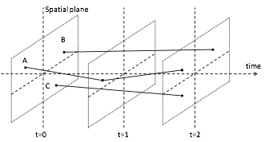

== Data model

The data model used by the binary encoding is equivalent to that used by the CSV encoding. <<fig1>> shows an example for trajectories of three moving points A, B and C. Each trajectory has the same start time and the same end time.

* At _t_ = 0 (start of all data), all points start moving.
* At _t_ = 1, the movement of A is changed.
* At _t_ = 2 (end of all data), the movement of A, B and C are changed.

[[fig1]]
.example for three trajectories

In the case, the trajectory of A from _t_ = 0 to _t_ = 1 and from _t_ = 1 to _t_ = 2 is encoded, together with the trajectories of B and C from _t_ = 0 to _t_ = 2.