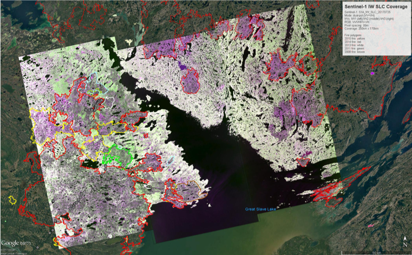

[[Implementation_Challange]]
== Implementation Challenge

This chapter provides more background information on the implemented use case and the data and SNAP graph provided to the participants.

[[Implementation_Challange_UseCase]]
=== Use Case

Canada’s forests cover an area of 348 million hectares, which is 35% of Canada’s land area and 9% of the world’s forested area. Because vast areas are inaccessible, researchers use satellites such as Sentinel-1 to gain valuable insights into Canada’s forest ecosystem. The Hackathon evaluated the extent of wild fires based on Sentinel-1 data for the summer of 2017 over the Northwest Territories (NWT), Canada. The NWT cover an area of more than 1,300,000 km2 (500,000 sq. mi), with 28 million hectares of largely inaccessible forestlands. There is a large climate variant from north to south, with subarctic climate to polar climate, causing short and cool (mid-teens Celsius) summers and long and harsh winters. Large wildfires occurred in the area in 2013, 2014 and 2015. Given the enormous extent of that area and its inaccessibility, researchers depend on satellite data to assess post-fire burns, which are an essential element in understanding the impacts and disturbances on forestlands caused by fires.

=== Satellite and Terrain Data

Sentinel-1 provides an excellent opportunity to investigate C-band SAR information for mapping wildfires in NWT. ESA provided 128 Sentinel-1 Interferometric Wide Swath images (832 GB) for two coverages (beginning and end of summer 2017) of the entire NWT. The Interferometric Wide (IW) swath mode is the main acquisition mode over land and satisfies the majority of service requirements. It acquires data with a 250km swath at 5m by 20m spatial resolution (single look).

Natural Resources Canada provided a Canadian Digital Elevation Model (CDEM) for terrain correction due to lack of SRTM over 60° North.

=== Process

NRCan provided a SNAP graph performing that executed 5 tasks in order to generate a GeoTIFF file per satellite scene. Additional Digital Elevation Model data is used for terrain correction. Overall, the process looked like illustrated in the figure below.

[[fig3]]
.SNAP Graph performing 5 tasks, using a single Sentinel-1 scene and DEM data for terrain correction

The output is a GeoTiff file that allows the identification of burn scars. The necessary mosaicking, i.e., the merging of all 128 scenes into a single image was not part of the Hackathon. A sample output file is illustrated below.

[[fig4]]
.SNAP Graph performing 5 tasks, using a single Sentinel-1 scene and DEM data for terrain correction

