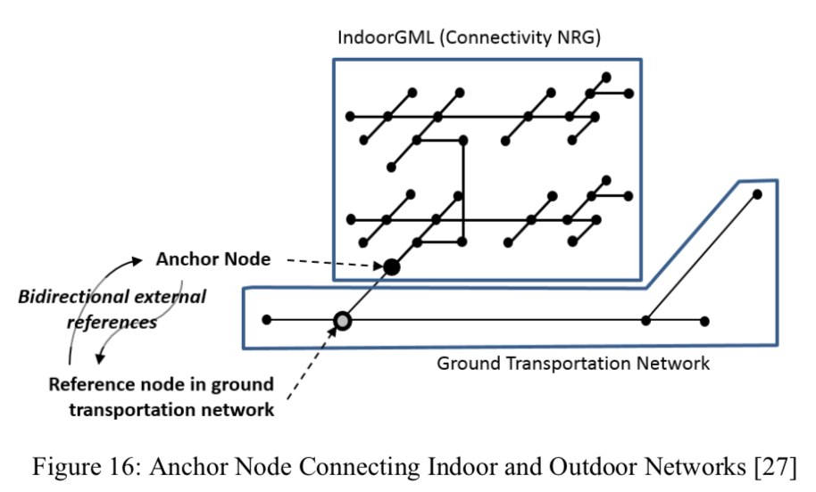

[[the_connection_between_indoor_and_outdoor_spaces]]
== The connection between indoor and outdoor spaces

Designing a converged data model to represent indoor and outdoor spaces is one of the typical issues on geographic information systems. In particular, a route navigation service is primarily associated with the network model of connectivity of roads. Compared to many standard formats that represent outdoor networks, only IndoorGML provides a standard model to describe the connectivity of components in indoor space. Since IndoorGML has been published, various studies have been carried out to express indoor and outdoor space connections.

[[fig1]]
.Anchor node connecting indoor and outdoor networks (OGC 14-005r5)

As shown in <<fig1>>, IndoorGML introduces a simple concept of an "anchor node" for representing indoor and outdoor connections. For example, an "entrance" is represented as an anchor node, a topological node to connect an indoor and outdoor element.

However, there is no element in the IndoorGML Core (and Navigation) model to represent anchor node, and specific examples of how to apply IndoorGML for connecting outdoor elements, such as roads, junctions, and pedestrian ways, are excluded in the IndoorGML standard document. In [4], the indoor and outdoor connections are expressed by extending the _State_ and _Transition_ of the core module of IndoorGML to _SpecialState_ (Anchor node) and _SpecialTransition_ (Anchor edge). However, this extension brings cost overruns when constructing and managing all indoor and outdoor data in/for an IndoorGML document.

This discussion paper proposes an IndoorGML extension model to interconnect indoor and outdoor models for seamless navigation by defining anchor node in the model. To this end, this document includes:

[class=steps]
. Definition of a conversion matrix between indoor and outdoor coordinate systems
. Definition of the element of anchor node that extends IndoorGML core and navigation modules
